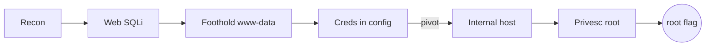

# Output format

Emit a challenge design using these sections, in this order, with these exact
headings (translated to the user's language). Omit a section only when it is
genuinely inapplicable (e.g. a single-host challenge has no pivot) and say why.
Keep terminology consistent with the rest of the design.

---

## 4.1 Technical sheet (ficha técnica)

A compact header block:

- **Name / codename**
- **Category & difficulty**
- **Narrative** — one or two sentences of theme/story
- **OS & versions**
- **Technologies & services**
- **Topology** — hosts/containers/segments at a glance
- **Entry point**
- **Final objective**
- **Flags** — list each with location and the permission required to read it
- **Assumptions & dependencies** — every assumption you made, stated explicitly

## 4.2 Scenario architecture

Describe assets, services, users, trust boundaries, and relationships. For each
asset note its exposure class (exposed initially / discovered by enumeration /
reachable after exploitation / internal needs-pivoting / protected objective).

## 4.3 Attack-path diagram

A sequential or graphical view of the main chain, e.g.:

`[Recon] → [Vuln discovery] → [Initial access] → [Local enum] → [Privesc] → [Final flag]`

Represent branches, pivots, and parallel dependencies explicitly. Prefer a Mermaid
`flowchart` when there is more than one host or any branching:



## 4.4 Step-by-step breakdown

One block per stage. Use this exact template per stage:

```
### Stage N — <short title>
- Objective: <what the player achieves>
- Initial state: <access/permissions the player holds entering this stage>
- Player action: <what they must discover, analyze, or execute>
- Technique / vulnerability: <mechanism; tag ATT&CK ID / CWE / OWASP / CVE if apt>
- Preconditions: <requirements and dependencies from prior stages>
- Expected result: <the evidence that confirms success>
- Natural hint (breadcrumb): <how the player deduces the next step>
- Transition: <exactly what this stage hands to the next>
- Flag / artifact: <if any>
- References: <ATT&CK / CVE / docs, only when needed>
```

## 4.5 Tactical coherence matrix

| Stage | Technique | Justification (why it works here) | Available hint | Depends on | Validation status |
|---|---|---|---|---|---|

`Validation status` uses the four tiers from `validation.md`: *Proposed design* /
*Conceptually validated* / *Experimentally validated* / *Integrity-validated*.

## 4.6 Flag matrix

| Flag | Location | Permission required | Associated stage | Purpose in the challenge |
|---|---|---|---|---|

## 4.7 Unintended-solutions validation

| Alternative route | Cause | Impact | Mitigation | Regression test |
|---|---|---|---|---|

Mitigations must preserve technical realism and must not forbid legitimate solving
techniques — they close the *accidental* shortcut, not the intended skill.

## 4.8 Test plan

A procedure to: deploy a clean instance, reproduce the main path end to end, verify
each flag, probe the known alternative routes, and confirm the breadcrumbs are
sufficient (ideally with a fresh solver who hasn't seen the design).

State clearly, for every claim in the deliverable, which validation tier it is at.
**Never label the path "tested" unless it was actually executed.** Default new
designs to *Proposed design* / *Conceptually validated* and say so.
